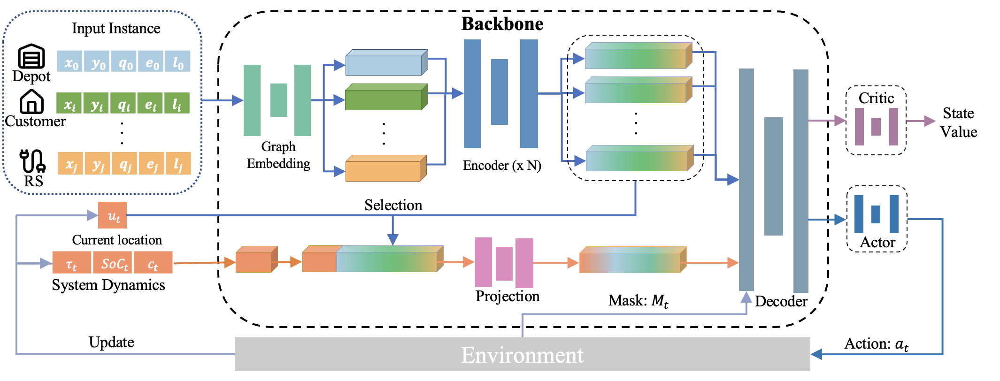
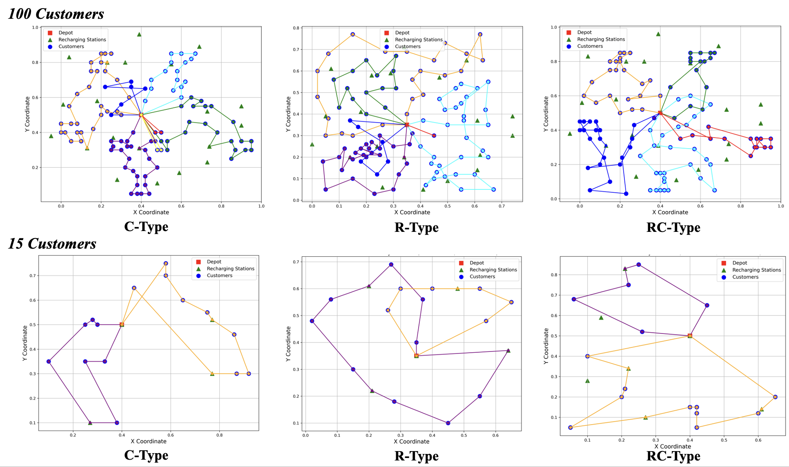

# TERRAN: A Transformer-based Electric Vehicle Routing Agent for Real-time Adaptive Navigation

---

## Introduction

**TERRAN** (*Transformer-based Electric-vehicle Routing agent for Real-time Adaptive Navigation*) is an end-to-end deep reinforcement learning framework for the **Electric Vehicle Routing Problem with Time Windows (EVRP-TW)**. Unlike exact solvers (optimal but slow) and metaheuristics (fast but fragile under tight constraints), TERRAN embeds **hard feasibility** directly into the decision process. A constraint-aware Transformer decoder selects the next node while enforcing time windows, battery/charging, and capacity constraints—eliminating post-hoc repairs and multi-stage heuristics.

On Solomon benchmarks (5–100 customers), TERRAN delivers **real-time** inference with **consistent feasibility**: it matches CPLEX on 5-customer cases, is within **0.6%** of optimal on 15-customer cases while achieving up to **1.7×10⁵ speedup**, and returns feasible solutions for 100-customer instances in sub-second time where CPLEX frequently fails within a one-hour limit. These results position TERRAN as a practical backbone for online dispatch and scalable EV routing.

## Contributions

1. **Future-Feasibility Pruning (FFP):**  
   A look-ahead energy-reachability check that prunes actions which would strand the vehicle, guaranteeing that every step maintains the ability to reach a charging station or depot.

2. **Staged Reward Scheduling:**  
   A curriculum that transitions from dense feasibility-oriented signals to distance-optimal rewards, stabilizing training and improving final route quality.

3. **Constraint-Aware Transformer Decoder:**  
   An end-to-end policy that integrates time windows, SoC dynamics, and capacity into attention masking and decoding—yielding feasible solutions without post-processing.

4. **Scalable, Real-Time EVRP-TW Solver with Open Implementation:**  
   Parallelized rollouts and efficient decoding enable sub-second inference across sizes (5–100 customers). We provide a reproducible codebase and Solomon-style data generation for transparent benchmarking and extension.

---

## Model Architecture


---

## Dataset
We use the **Solomon Dataset** (see [README.md](./data/README.md)) for validation and **Solomon-like synthetic datasets** for training both the policy network (backbone) and the critic network.  

---

## Repository Structure
```
.
├── baseline                # Baselines for comparison (CPLEX and VNS/TS implementations)
├── configs                 # Configuration files for different customer scales (5, 15, 100, etc.)
├── data                    # Solomon dataset and converted validation-ready format
├── envs                    # Custom environments for EVRP-TW
├── instance_generator.py   # Script to generate validation instances
├── models                  # Policy network and critic network implementations
├── results                 # Experimental results and plots
├── train.py                # Main training script
├── utils                   # Helper functions and utilities
├── wrappers                # Environment wrappers for training
└── README.md
```

---

## Quick Demo

The training workflow consists of two steps:  

1. **Dataset Generation**  
2. **Agent Training**

### Step 1: Generate Validation Dataset
Run the following command to generate the validation Solomon-like dataset (5 customers for example):

```bash
python instance_generator.py \
  --config ./configs/config_5c.json \
  --data_path ./data/solomon_datasets/small_instances/Cplex5er/ \
  --save_root ./data/solomon_evrptw_input/ \
  --instance_type all
```

### Parameters (`instance_generator.py`)

- **`--config`**: Path to the configuration file of the validation dataset.  
  - We provide prepared configs for **5, 15, and 100 customers** in `./configs/`.  
  - Parameters are derived from the **original Solomon Dataset**.  

- **`--data_path`**: Path to the raw Solomon dataset (in `./data/solomon_datasets/`).  
  - The generator converts `.txt` Solomon instances into usable validation data.  

- **`--instance_type`**: Select dataset type:  
  - `(R)` Random customers  
  - `(C)` Clustered customers  
  - `(RC)` Mixed types  


### Step 2: Train the Agent
Once the validation set is prepared, run (5 customer instance for example):
```bash
python train.py \
  --num-envs 512 \
  --num-steps 40 \
  --n-test 12 \
  --test_agent 100 \
  --config_path ./configs/config_5c.json
```

### Training Parameters (`train.py`)

- **Optimization**
  - `--learning-rate` *(float, default: 1e-4)* → Learning rate for optimizer.  
  - `--weight-decay` *(float, default: 1e-5)* → Weight decay for optimizer.  
  - `--num-envs` *(int, default: 512)* → Number of parallel environments.  
  - `--num-steps` *(int, default: 40)* → Steps per rollout in each environment.  
  - `--anneal-lr` *(bool, default: True)* → Enable LR annealing.  

- **PPO Parameters**
  - `--gamma` *(float, default: 0.99)* → Discount factor.  
  - `--gae-lambda` *(float, default: 0.98)* → GAE lambda.  
  - `--num-minibatches` *(int, default: 32)* → Number of mini-batches.  
  - `--update-epochs` *(int, default: 4)* → Policy update epochs.  
  - `--norm-adv` *(bool, default: True)* → Normalize advantages.  
  - `--clip-coef` *(float, default: 0.2)* → Clipping coefficient for PPO objective.  
  - `--clip-vloss` *(bool, default: True)* → Clip value loss.  
  - `--ent-coef` *(float, default: 0.01)* → Entropy coefficient.  
  - `--vf-coef` *(float, default: 0.6)* → Value function coefficient.  
  - `--max-grad-norm` *(float, default: 1.0)* → Gradient clipping max norm.  
  - `--target-kl` *(float, default: None)* → Target KL divergence.  

- **Model Architecture**
  - `--tanh_clipping` *(float, default: 15.0)* → Tanh clipping threshold.  
  - `--n_encode_layers` *(int, default: 4)* → Number of encoder layers.  

- **Evaluation / Testing**
  - `--n-traj` *(int, default: 100)* → Number of trajectories in sub-environments.  
  - `--n-test` *(int, default: 12)* → Number of test instances.  
  - `--multi-greedy-inference` *(bool, default: True)* → Use multiple trajectory greedy inference.  
  - `--test_agent` *(int, default: 100)* → Number of test agents.  
  - `--beam_search` *(bool, default: False)* → Enable beam search.  
  - `--beam_size` *(int, default: 20)* → Beam size if enabled.  
  - `--temperature` *(float, default: 1.1)* → Temperature for sampling.  
  - `--config_path` *(str, default: "./configs/config_5c.json")* → Path to config file.  

---

## Experiment Results


---

## Citation
If you use this repository, please cite:

---

## License
This project is licensed under the Apache-2.0 License.


